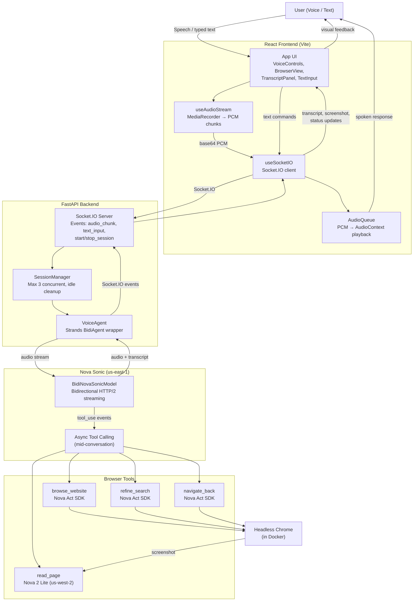
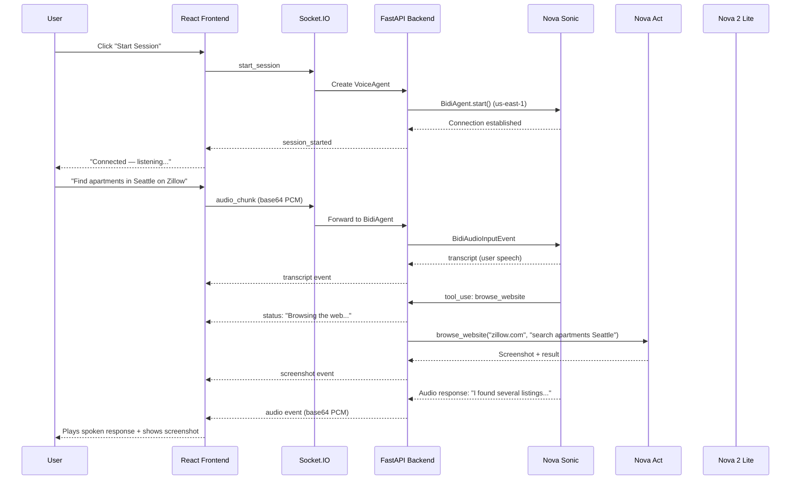
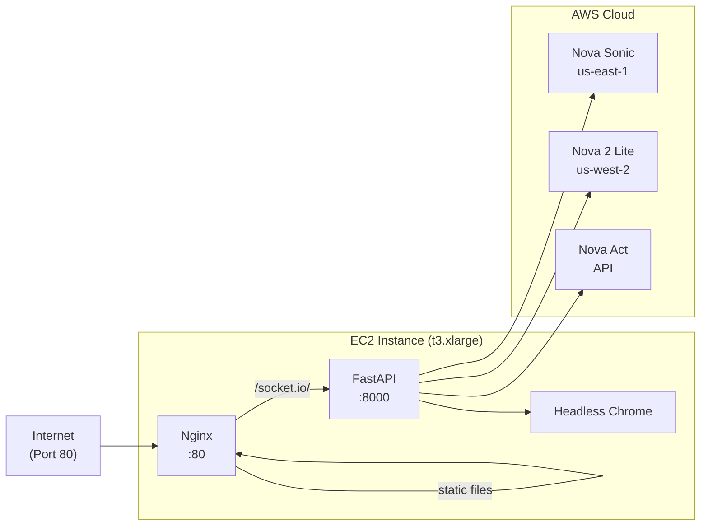

# AccessVoice — System Architecture

## High-Level Flow

## Data Flow Detail

## Component Responsibilities

| Component | Technology | Responsibility |
|-----------|-----------|----------------|
| **Frontend** | React 18 + TypeScript + Vite | Audio capture/playback, Socket.IO transport, visual feedback |
| **Backend** | FastAPI + python-socketio | Session management, VoiceAgent lifecycle, event routing |
| **VoiceAgent** | Strands BidiAgent | Nova Sonic connection, event loop, tool dispatch |
| **browse_website** | Nova Act SDK | Navigate to URLs, perform browser actions |
| **read_page** | Nova 2 Lite (Bedrock) | Analyze screenshots for accessibility summaries |
| **refine_search** | Nova Act SDK | Adjust filters/queries on current page |
| **navigate_back** | Nova Act SDK | Browser history navigation |
| **Nginx** | nginx:alpine | Reverse proxy, WebSocket upgrade, static file serving |

## Deployment Topology

