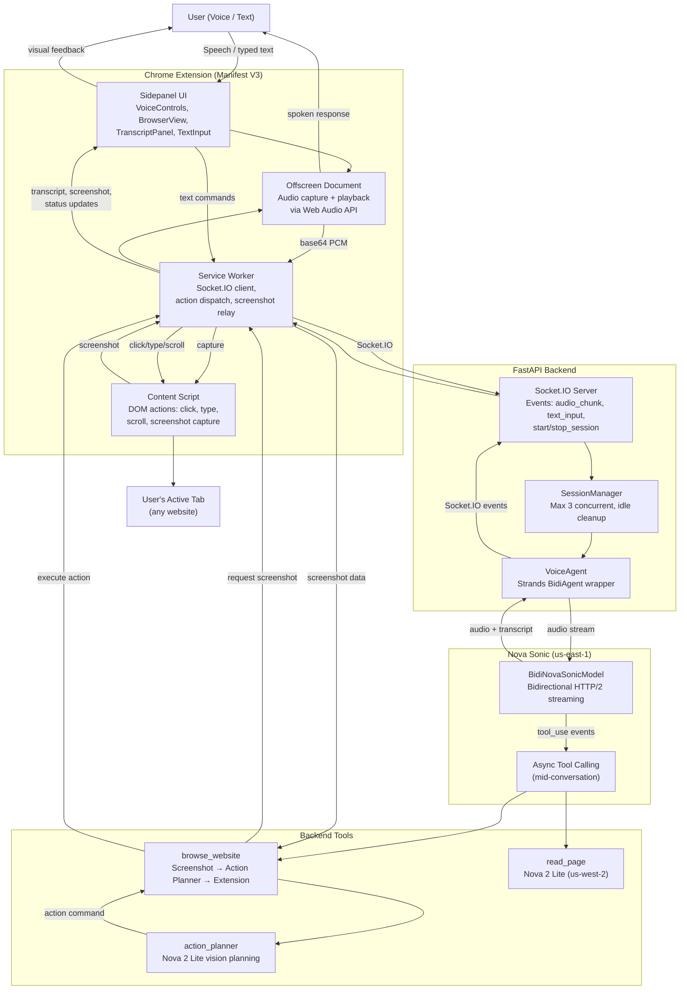
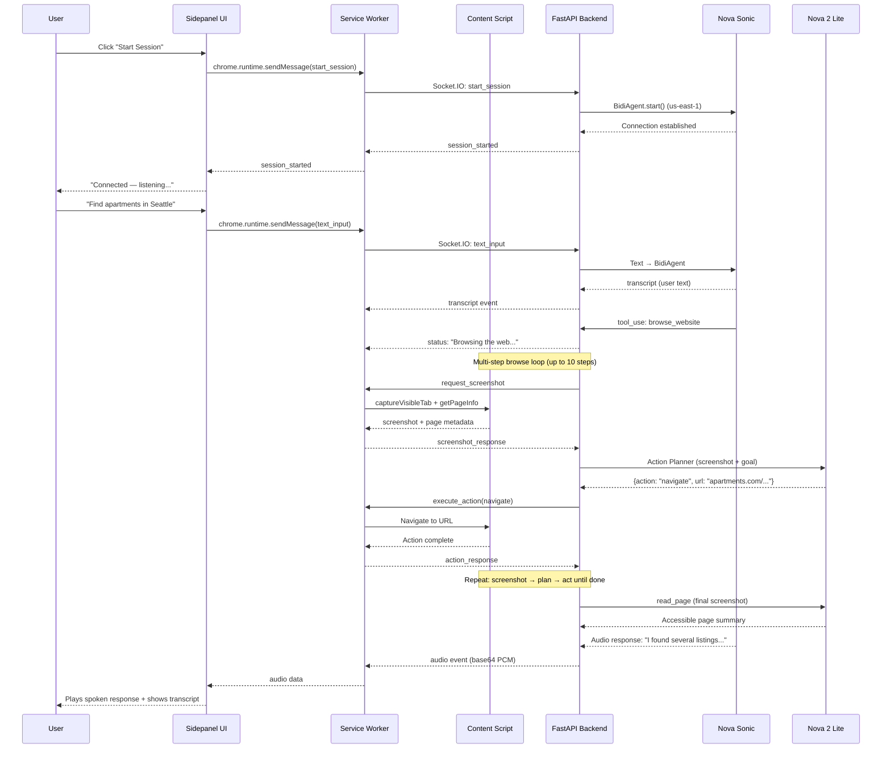
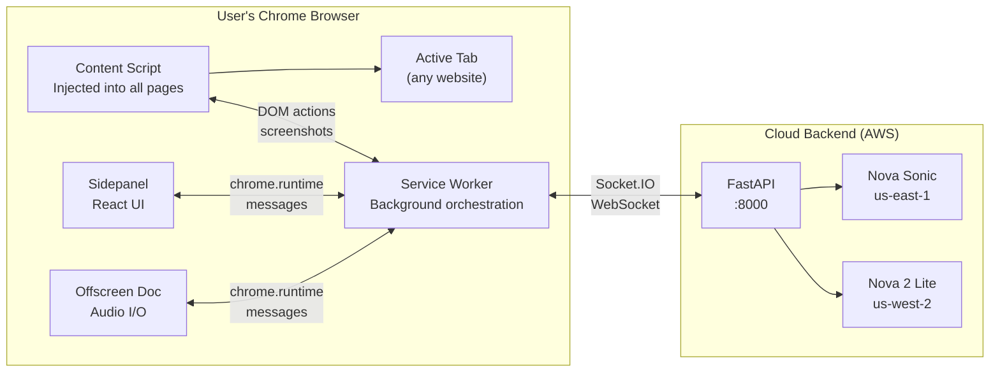

# AccessVoice — System Architecture

## High-Level Flow

## Data Flow Detail

## Component Responsibilities

| Component | Technology | Responsibility |
|-----------|-----------|----------------|
| **Sidepanel** | React 18 + TypeScript | Voice controls, transcript display, text input, browser view |
| **Service Worker** | Chrome MV3 + Socket.IO | Backend communication, screenshot relay, action dispatch |
| **Content Script** | Vanilla JS | DOM actions (click, type, scroll), screenshot capture, page info |
| **Offscreen Document** | Web Audio API | Microphone capture (PCM), audio playback queue |
| **Backend** | FastAPI + python-socketio | Session management, VoiceAgent lifecycle, event routing |
| **VoiceAgent** | Strands BidiAgent | Nova Sonic connection, event loop, tool dispatch |
| **browse_website** | Extension coordination | Multi-step browsing: screenshot → plan → act loop |
| **action_planner** | Nova 2 Lite (Bedrock) | Vision-based DOM action planning from screenshots |
| **read_page** | Nova 2 Lite (Bedrock) | Accessibility-friendly page summaries from screenshots |

## Extension Architecture

